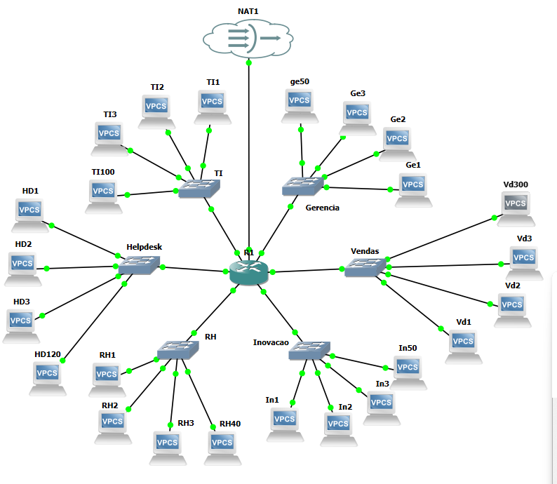
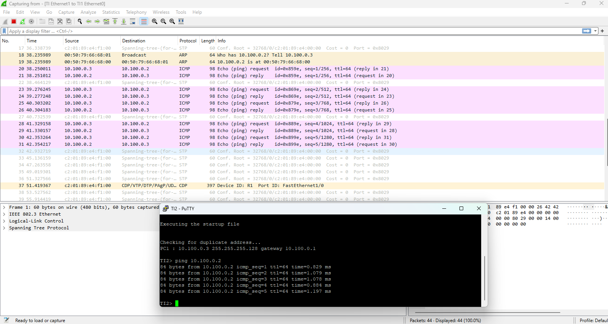
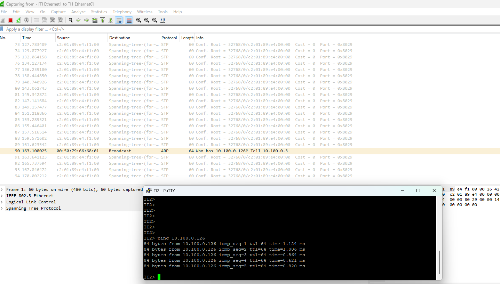
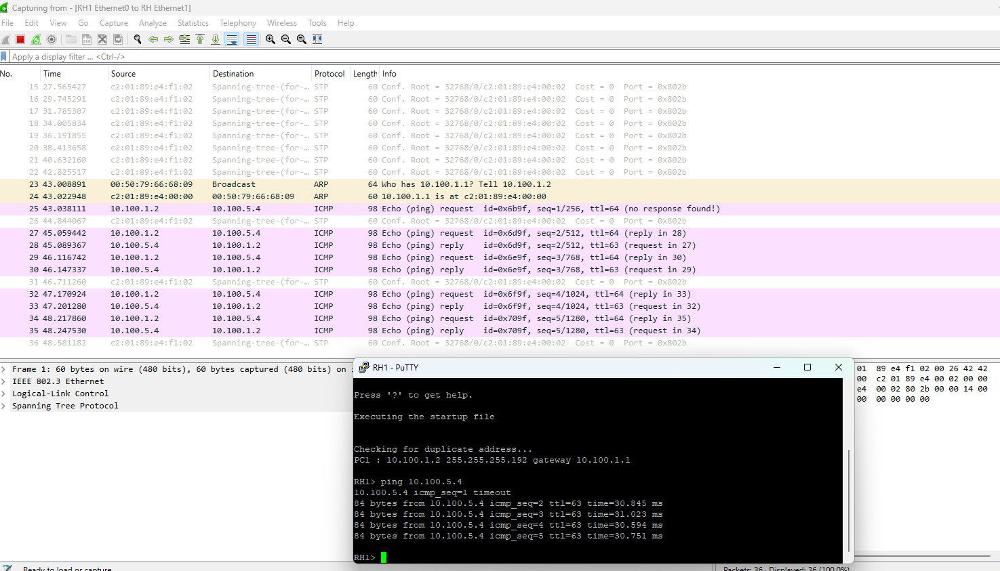
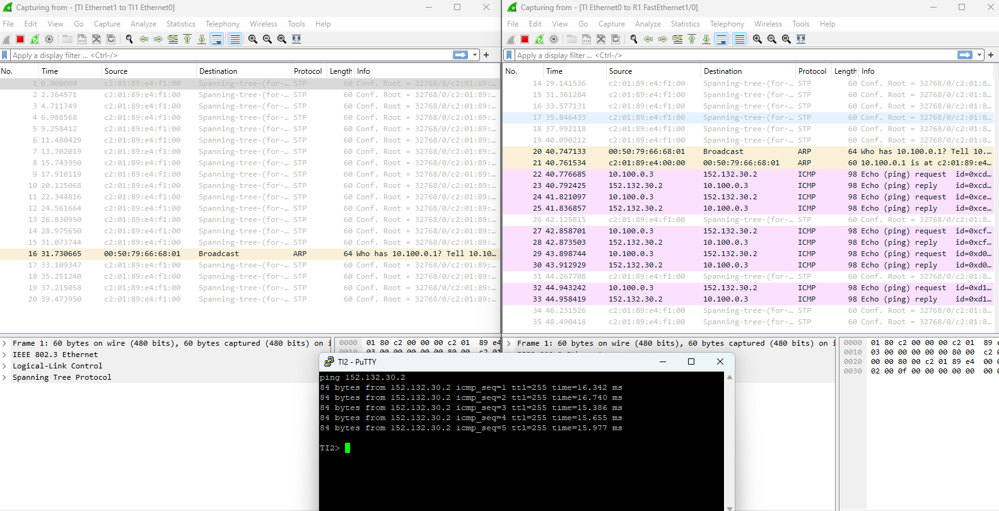

# Projeto_ADA
Projeto desenvolvido no tópico de Redes para a aula da ADA

## Participantes
Ana Caroline Manso de Carvalho

Anderson Souza de Freitas

Fábio Rodrigues de Andrade Santos

## Introdução
O trabalho consiste no cenário de um empresa que tem o intuito de criar uma rede baseada na faixa 10.100.0.0/20, com os diferentes departamentos: TI, Helpdesk, Recursos Humanos (RH), Inovação, Vendas e Gerência.
O projeto foi desenvolvido com o software GNS3

## Requisitos
Sub-redes de cada departamento:
    - TI: 100 hosts (com possibilidade de expansão futura sem alterar IPs já atribuidos)
    - Helpdesk: 120 hosts
    - Inovação: 50 hosts (expansão futura para 129 hosts)
    - Vendas: 300 hosts
    - Gerência> 50 hosts

Servidor Externo:
- Endereço do servidor: 152.132.30.0/29
- Todas as sub-redes devem se conectar a este servidor para a validação de comunicação externa.

## Desenvolvimento

### Calculo das sub-redes
n° hosts <= 2^n - 2
- TI (100 hosts)
    $100 < 2^7 - 2 (126)$

    $32-7=25$
    
    Máscara da sub-rede: /25 = 255.255.255.128
- Helpdesk (120 hosts)
    $120 < 2^7 - 2 (126)$
    
    $32-7=25$
    
    Máscara da sub-rede: /25 = 255.255.255.128
- RH (40 hosts)
    $40 < 2^6 - 2 (62)$
    
    $32-6=26$
    
    Máscara da sub-rede: /26 = 255.255.255.192
- Inovação (129 hosts)
    $129 < 2^8 - 2 (254)$
    
    $32-8=24$
    
    Máscara da sub-rede: /24 = 255.255.255.0
- Vendas (300 hosts)
    $300 < 2^9 - 2 (510)$
    
    $32-9=23$
    
    Máscara da sub-rede: /23 = 255.255.254.0
- Gerencia (50 hosts)
    $50 < 2^6 - 2 (62)$
    
    $32-6=26$
    
    Máscara da sub-rede: /26 = 255.255.255.192

Com esses valores pode-se definir o valor para os intervalos:
- TI:-------10.100.0.0 - 10.100.0.127
- Helpdesk:-10.100.0.128 - 10.100.0.255
- RH:-------10.100.1.0 - 10.100.1.63
- Inovação:-10.100.2.0 - 10.100.2.255
- Vendas:---10.100.6.0 - 10.100.7.255
- Gerência:-10.100.5.0 - 10.100.5.63

Endereçamento de rede:
- TI:-------10.100.0.0/25
- Helpdesk:-10.100.0.128/25
- RH:-------10.100.1.0/26
- Inovação:-10.100.2.0/24
- Vendas:---10.100.3.0/23
- Gerência:-10.100.5.0/26


### Rodando o projeto
O projeto já está configurado, após o carregar, deve-se apertar os botões "reload all nodes" e "start/resume all nodes". Caso encontre alguma falha, rode novamente o código de configuração do roteador em seu terminal (caso queira zerar as configurações previamente carregadas utilize o comando "write erase" no terminal do roteador) , espere carregar as configurações e teste novamente.
### Código de Configuração do roteado
O roteador utilizado foi criado com a imagem do roteador c3725.
Foi criado um login e senha para configurar o roteador, assim como deveria ser nas empresas por questão de segurança, no caso educalcional todas as senhas são iguais "ada123".  Usuário: admin

```bash
#Configuração do Roteador

enable
configure terminal

#========== GENERAL CONFIGURATION ==========
hostname R1
no ip domain-lookup
service password-encryption
banner motd ^Acesso Restrito - Rede Corporativa^

#========== SECURITY ==========
enable secret ada123
username admin privilege 15 secret ada123
line console 0
 password ada123
 login local
 logging synchronous
 exit
line vty 0 4
 transport input ssh
 login local
 exit

#========== VLAN CONFIGURATION ==========
vlan 999
 name NATIVE_UNUSED
 exit

vlan 10
 name TI
 exit
vlan 20
 name HELPDESK
 exit
vlan 30
 name RH
 exit
vlan 40
 name INOVACAO
 exit
vlan 50
 name VENDAS
 exit
vlan 60
 name GERENCIA
 exit

#========== TRUNK PORTS (TO SWITCHES) ==========
interface range FastEthernet1/0 - 5
 switchport trunk encapsulation dot1q
 switchport mode trunk
 switchport trunk native vlan 999
 switchport trunk allowed vlan 1-2,10,20,30,40,50,60,1002-1005
 no shutdown
 exit

#Department-specific trunk adjustments
interface FastEthernet1/0
 description TRUNK-TI
 switchport trunk allowed vlan 1-2,10,1002-1005
 exit

interface FastEthernet1/1
 description TRUNK-HELPDESK
 switchport trunk allowed vlan 1-2,20,1002-1005
 exit

interface FastEthernet1/2
 description TRUNK-RH
 switchport trunk allowed vlan 1-2,30,1002-1005
 exit

interface FastEthernet1/3
 description TRUNK-INOVACAO
 switchport trunk allowed vlan 1-2,40,1002-1005
 exit

interface FastEthernet1/4
 description TRUNK-VENDAS
 switchport trunk allowed vlan 1-2,50,1002-1005
 exit

interface FastEthernet1/5
 description TRUNK-GERENCIA
 switchport trunk allowed vlan 1-2,60,1002-1005
 exit


interface FastEthernet1/6
 description Servidor - Externo
 no switchport
 ip address 152.132.30.2 255.255.255.248
 no shutdown
 exit


#========== LAYER 3 CONFIGURATION ==========
interface Vlan10
 description TI
 ip address 10.100.0.1 255.255.255.128
 no shutdown
 exit

interface Vlan20
 description HELPDESK
 ip address 10.100.0.129 255.255.255.128
 no shutdown
 exit

interface Vlan30
 description RH
 ip address 10.100.1.1 255.255.255.192
 no shutdown
 exit

interface Vlan40
 description INOVACAO
 ip address 10.100.2.1 255.255.255.0
 no shutdown
 exit

interface Vlan50
 description VENDAS
 ip address 10.100.6.1 255.255.254.0
 no shutdown
 exit

interface Vlan60
 description GERENCIA
 ip address 10.100.5.1 255.255.255.192
 no shutdown
 exit

#========== WAN INTERFACE ==========
interface FastEthernet1/6
 description LINK-EXTERNO
 no switchport
 ip address 152.132.30.2 255.255.255.248 
 #ip nat outside
 no shutdown
 exit


#TI VLAN (10)
interface FastEthernet1/0
 switchport mode access
 switchport access vlan 10
 no shutdown
 exit

#Helpdesk VLAN (20)
interface FastEthernet1/1
 switchport mode access
 switchport access vlan 20
 no shutdown
 exit

#RH VLAN (30)
interface FastEthernet1/2
 switchport mode access
 switchport access vlan 30
 no shutdown
 exit

#Inovação VLAN (40)
interface FastEthernet1/3
 switchport mode access
 switchport access vlan 40
 no shutdown
 exit

#Vendas VLAN (50)
interface FastEthernet1/4
 switchport mode access
 switchport access vlan 50
 no shutdown
 exit

#Gerência VLAN (60)
interface FastEthernet1/5
 switchport mode access
 switchport access vlan 60
 no shutdown
 exit

#======================================================================
#Configuração NAT

#limpando configurações existentes
no ip nat inside source list NAT-ACL interface FastEthernet1/6 overload
no ip nat inside source list NAT_TRAFFIC interface FastEthernet1/6 overload
no ip access-lis standard NAT_TRAFFIC
#Configurando
ip access-list standard NAT_TRAFFIC
permit 10.100.0.0 0.0.255.255
exit

ip nat inside source list NAT_TRAFFIC interface FastEthernet1/6 overload

interface vlan10
 ip nat inside
 no shutdown
 exit

interface vlan20
 ip nat inside
 no shutdown
 exit
interface vlan30
 ip nat inside
 no shutdown
 exit
interface vlan40
 ip nat inside
 no shutdown
 exit
interface vlan50
 ip nat inside
 no shutdown
 exit
interface vlan60
 ip nat inside
 no shutdown
 exit

interface FastEthernet1/6
 ip nat outside
 no shutdown
 exit

end
write memory

```

### Configuração de IPs dos computadores das sub-redes
Os endereços de IP foram colacados máquina a máquina de maneira manual seguindo a ordem, serão colocados os primeiros IPs de cada departamento. As identificações foram definidos com siglas de duas letras e um número para cada computador (exemplo: TI1, TI2, ..., TI100).
- TI:
```bash
#TI
# VPCS 1
ip 10.100.0.2/25 10.100.0.1
save
# VPCS 2
ip 10.100.0.3/25 10.100.0.1
save
# VPCS 3
ip 10.100.0.4/25 10.100.0.1
save
# VPCS 4
ip 10.100.0.126/25 10.100.0.1
save
```
- Helpdesk:
```bash
#Helpdesk
# VPCS 1
ip 10.100.0.130/25 10.100.0.129
save
# VPCS 2
ip 10.100.0.131/25 10.100.0.129
save
# VPCS 3
ip 10.100.0.132/25 10.100.0.129
save
# VPCS 4
ip 10.100.0.250/25 10.100.0.129
save
```
- Recursos Humanos(RH):
```bash
#RH
# VPCS 1
ip 10.100.1.2/26 10.100.1.1
save
# VPCS 2
ip 10.100.1.3/26 10.100.1.1
save
# VPCS 3
ip 10.100.1.4/26 10.100.1.1
save
# VPCS 4
ip 10.100.1.42/26 10.100.1.1
save
```
- Inovação:
```bash
#Inovação
# VPCS 1
ip 10.100.2.2/24 10.100.2.1
save
# VPCS 2
ip 10.100.2.3/24 10.100.2.1
save
# VPCS 3
ip 10.100.2.4/24 10.100.2.1
save
# VPCS 4
ip 10.100.2.52/24 10.100.2.1
save
```
- Vendas:
```bash
#Vendas
# VPCS 1
ip 10.100.6.2/23 10.100.6.1
save
# VPCS 2
ip 10.100.6.3/23 10.100.6.1
save
# VPCS 3
ip 10.100.6.4/23 10.100.6.1
save
# VPCS 4
ip 10.100.7.254/23 10.100.6.1
save
```
- Gerência:
```bash
#Gerencia
# VPCS 1
ip 10.100.5.2/26 10.100.5.1
save
# VPCS 2
ip 10.100.5.3/26 10.100.5.1
save
# VPCS 3
ip 10.100.5.4/26 10.100.5.1
save
# VPCS 4
ip 10.100.5.62/26 10.100.5.1
save
```

### Topologia



## Testes
### Realizando Ping na mesma coordenação
### TI2 ping TI1 - Wireshark conexão TI1


### TI2 ping TI100 - Wireshark conexão TI1
Como podemos ver, o broadcast foi capturado, mas a conexão estabelicida não é com o computador o qual está em análise no wireshark



### RH1 ping Ge3 - Wireshark RH1


### TI2 Servidor Externo (Nuvem) - Wireshark conexões TI1 e Switch TI


